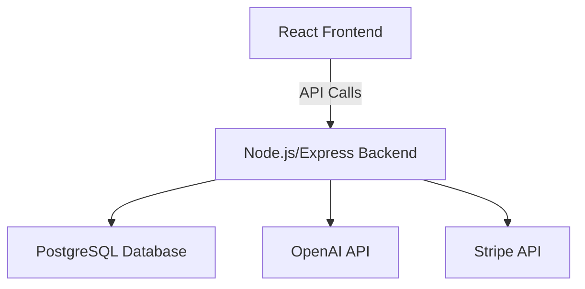

# ShopPilot: AI-Powered Content Generator for Shopify/WooCommerce Sellers

## Overview
ShopPilot is a SaaS platform enabling Shopify and WooCommerce sellers to generate product descriptions, titles, and meta tags using AI. It features user authentication, usage tracking, Stripe billing, and a React-based dashboard.

---

## Features

- **AI Content Generation:** Create product descriptions, titles, and meta tags tailored for e-commerce.
- **User Authentication:** Secure login and registration system.
- **Usage Tracking:** Monitor content generation usage per user.
- **Stripe Billing:** Subscription management and payments via Stripe.
- **React Dashboard:** Intuitive UI for content generation and management.

---

## Tech Stack

- **Frontend:** React, TypeScript, Tailwind CSS
- **Backend:** Node.js, Express, PostgreSQL
- **AI Integration:** OpenAI API (or similar)
- **Authentication:** JWT, OAuth (optional)
- **Payments:** Stripe API

---

## High-Level Architecture

---

## Core Modules

### 1. Authentication

- User registration & login
- Password reset
- JWT-based session management

### 2. Content Generation

- Input: Product details
- Output: AI-generated descriptions, titles, meta tags
- History of generated content

### 3. Usage Tracking

- Track number of generations per user
- Display usage stats in dashboard

### 4. Billing

- Stripe subscription plans
- Payment history
- Upgrade/downgrade/cancel options

### 5. Dashboard

- Generate new content
- View/edit/download history
- Manage account & billing

---

## Example API Endpoints

| Method | Endpoint                | Description                      |
|--------|-------------------------|----------------------------------|
| POST   | `/api/auth/register`    | Register new user                |
| POST   | `/api/auth/login`       | User login                       |
| POST   | `/api/content/generate` | Generate product content         |
| GET    | `/api/content/history`  | Fetch user's content history     |
| GET    | `/api/usage`            | Get usage statistics             |
| POST   | `/api/stripe/webhook`   | Stripe payment webhook           |

---

## Next Steps

1. Set up project repositories (frontend & backend)
2. Implement authentication and Stripe billing
3. Integrate AI content generation
4. Build React dashboard
5. Deploy (Vercel/Netlify for frontend, Render/Heroku for backend)

---

## License

MIT
